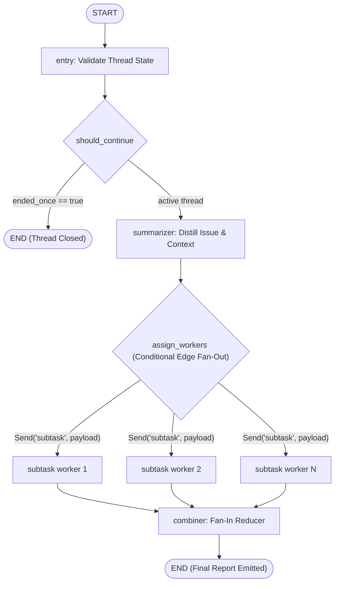

# System Architecture

FlowCheck uses an orchestrator–worker architecture implemented on top of LangGraph. This architecture separates unstructured incident comprehension from parallel decision evaluation and deterministic outcome combination.

## Execution Graph Pipeline

The runtime pipeline is declared as a `StateGraph` in `src/flow_agent/graph.py`:



## Node Specifications

### 1. Entry Node (`entry_node`)

- **Location**: `src/flow_agent/utils/nodes.py`
- **Purpose**: Guardrail for thread re-entry.
- **Behavior**: Inspects `state["ended_once"]`. If a thread has already generated a final report, the entry node halts further execution to avoid corrupting aggregated states or re-triggering expensive LLM calls.

### 2. Should Continue (`should_continue`)

- **Type**: Conditional Edge
- **Routes**:
  - `END`: When `ended_once` is set.
  - `"summarizer"`: When the thread is fresh and ready for processing.

### 3. Summarizer Node (`call_summarizer_model`)

- **Model**: `gemini-2.5-flash-lite` via Google GenAI SDK.
- **Purpose**: Consolidates complex incident descriptions, alerts, user chat messages, or logs into a normalized summary string.
- **State Updates**:
  - Populates `state["issue"]` with the generated summary.
  - Initializes `state["sub_issues_decision"]` with the full tuple of registered `DecisionID` targets.
  - Initializes `completed_sub_issues_decision` as an empty list.

### 4. Fan-Out Dispatcher (`assign_workers`)

- **Type**: Conditional Edge (Orchestrator).
- **Behavior**: Does not run as a graph node. Instead, it inspects `state["sub_issues_decision"]` and yields an array of `Send` instructions:
  ```python
  return [Send("subtask", {**state, "sub_issue": s}) for s in sub_issues]
  ```
- **Isolation Guarantee**: Each worker receives an isolated copy of the state with its specific `sub_issue` identifier.

### 5. Worker Nodes (`call_subtask_model`)

- **Model**: `gpt-5-nano` via OpenAI Agents SDK (`agents.Runner`).
- **Purpose**: Evaluates whether action is warranted for a single `DecisionID` against the incident summary.
- **Output**: Returns a single-element list `completed_sub_issues_decision: [DecisionOutput]`.

### 6. Combiner Node (`call_combiner_model`)

- **Type**: Fan-In Reducer.
- **Mechanism**: Because `completed_sub_issues_decision` in `State` uses `Annotated[list, operator.add]`, LangGraph automatically concatenates the results from all workers once they complete.
- **Assembly**: Calls `CombinedPlan.assemble_from_evaluators()`, which deterministically evaluates confidence thresholds (default: 0.6) and produces the unified `CombinedPlan`.
- **Termination**: Marks `ended_once = True` and transitions execution to `END`.
