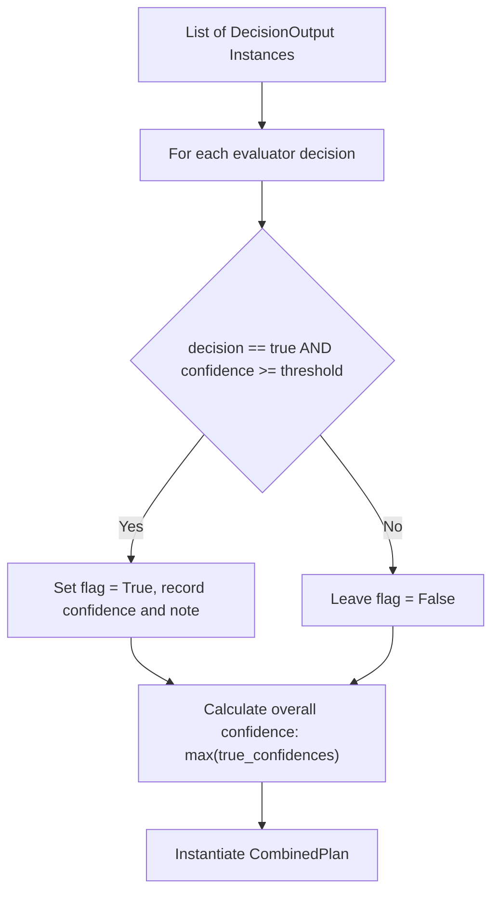

# Data Models & Schemas

FlowCheck defines its state structures and business schemas using Python `TypedDict` and `pydantic.BaseModel`. These models ensure strict validation, safe type casting, and predictable fan-in reduction.

## Graph State (`State`)

Defined in `src/flow_agent/utils/state.py`:

```python
class State(TypedDict):
    retry_count: Annotated[int, operator.add]
    messages: Annotated[list[BaseMessage], add_messages]
    issue: str
    sub_issues_decision: tuple[str, ...]
    sub_issue: NotRequired[str]
    completed_sub_issues_decision: Annotated[list, operator.add]
    final_report: CombinedPlan
    ended_once: bool
```

### Reducer Mechanics

- **`completed_sub_issues_decision`**: Uses `operator.add` as its reducer. When parallel worker nodes finish, their individual single-element lists are automatically concatenated into one aggregated list.
- **`messages`**: Uses LangGraph's native `add_messages` reducer to append incoming messages and preserve conversation history.
- **`sub_issue`**: Marked as `NotRequired` because it is only populated dynamically in the branch payload during the fan-out step.

## Business Models

Defined in `src/flow_agent/data_objs/business_objs.py`:

### 1. `DecisionOutput`

Encapsulates the verdict emitted by an individual evaluator node.

```python
class DecisionOutput(BaseModel):
    decision_id: DecisionID
    decision: bool
    confidence: float = Field(..., ge=0.0, le=1.0)
    model: Optional[str] = "default"
    notes: Optional[str] = None
    latency_ms: Optional[int] = Field(None, ge=0)
    thread_identifier: str = None
```

- **Confidence Validation**: A `@field_validator("confidence", mode="before")` rounds raw confidence floats to three decimal places.

### 2. `CombinedPlan`

Represents the unified operational plan emitted at the end of the pipeline.

```python
class CombinedPlan(BaseModel):
    # Action flags
    reset_vpn_profile: bool = False
    restart_sso_session: bool = False
    run_connectivity_diagnostics: bool = False
    update_internal_record: bool = False
    send_notification: bool = False
    approval_required: bool = False
    
    # Aggregated metadata
    generated_summary: str | None = ""
    thread_identifier: Optional[str] = None
    confidence: float = Field(0.0, ge=0.0, le=1.0)
    task_specific_notes: Optional[list[str]] = []
```

## Deterministic Combiner Algorithm

The `assemble_from_evaluators` method constructs the final plan without additional LLM calls:



### Combiner Rules

1. **Threshold Filtering**: An action flag is set to `True` if and only if its evaluator reported `decision == True` and `confidence >= conf_threshold` (default: `0.6`).
2. **Confidence Aggregation**: The overall plan confidence equals the maximum confidence among all triggered actions (or `0.0` if no actions are triggered).
3. **Traceable Notes**: Action-specific notes are formatted as `[<decision_id>] <notes>` and collected into `task_specific_notes`.
