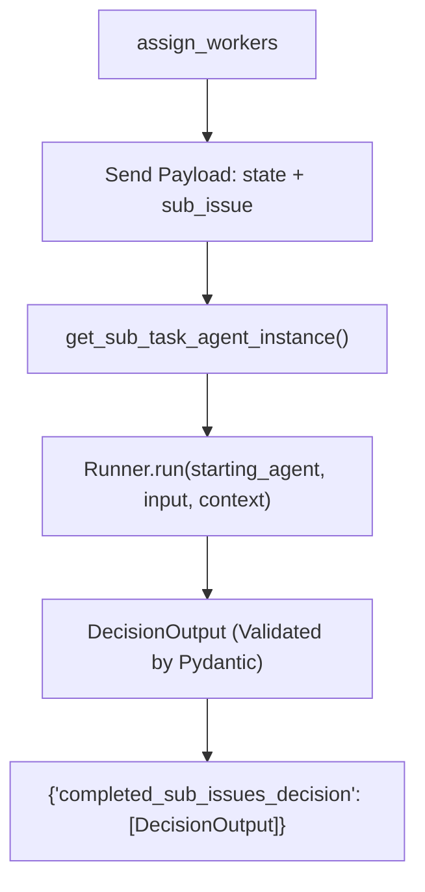

# Decision Evaluators

FlowCheck uses modular, isolated evaluators to make individual decisions on whether operational actions should be triggered. Each evaluator specializes in a specific decision domain and produces a structured `DecisionOutput`.

## Decision Catalog & Triggers

The system defines six core operational decisions in `src/flow_agent/data_objs/business_objs.py`:

| Decision ID | Trigger Condition | Common Symptoms & Indicators |
| :--- | :--- | :--- |
| `reset_vpn_profile` | Repeated VPN disconnects, corrupted tunnel profiles, or gateway auth failures. | Handshake timeout, tunnel dropped, bad cert cache |
| `restart_sso_session` | Expired sessions, OAuth/SAML login loops, or token refresh rejections. | HTTP 401 loop, invalid JWT, expired refresh token |
| `run_connectivity_diagnostics` | Network failures, unreachable internal microservices, or packet loss. | DNS lookup failures, high latency spikes, dropped pings |
| `update_internal_record` | Status updates, onboarding/offboarding events, or asset tracking changes. | Service catalog drift, user role reassignment |
| `send_notification` | Escalation requirements, operational alerts, or communications to on-call staff. | Severity 1/2 alerts, threshold breaches, stakeholder paging |
| `approval_required` | Policy checkpoints, compliance constraints, elevated privileges, or exceptions. | Production DB access, destructive reboot, security override |

## Dynamic Prompt Synthesis

Each evaluator receives a prompt generated at runtime by `dynamic_instructions` in `src/flow_agent/llms/sub_task_agent.py`. The prompt injects the specific trigger definition into a strictly typed evaluation contract:

```text
as a agent of <decision_id>. 
You are an automated decision evaluator.

Input:
- decision_id: <decision_id>
- context: unstructured text containing events, logs, symptoms, actions, or user reports.

Task:
1. Read and interpret the context.
2. Based solely on the meaning of the decision_id, determine if action is required:
   - <Trigger condition from DECISION_TRIGGERS>
3. Return:
   - decision: true if action is warranted, false otherwise
   - confidence: 0.0–1.0 expressing certainty
   - model: name of the model producing the output
   - notes: concise reasoning (optional), must be maximum 10 words.
   - latency_ms: leave empty

Output JSON strictly in the following structure:
{
  "decision_id": "<decision_id>",
  "decision": true or false,
  "confidence": 0.0,
  "model": "gpt-5-nano",
  "notes": "short rationale",
  "latency_ms": null
}
```

## Worker Execution Pattern

Evaluators run inside an `agents.Runner` session:



## Worker Response Contract

Workers emit a `DecisionOutput` instance validated by Pydantic:

```json
{
  "decision_id": "run_connectivity_diagnostics",
  "decision": true,
  "confidence": 0.85,
  "model": "gpt-5-nano",
  "notes": "Packet loss detected across edge routers",
  "latency_ms": null,
  "thread_identifier": "run-abc-123"
}
```

This clean schema ensures that the downstream Combiner can merge decisions deterministically without further parsing.
