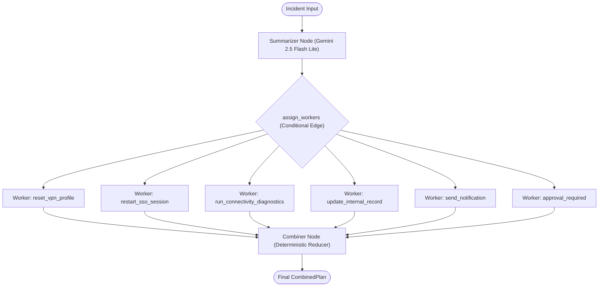

# FlowCheck Overview

FlowCheck is an automated decision evaluation engine designed to triage operational incidents, infrastructure alerts, and service logs. Built on **LangGraph**, it coordinates a heterogeneous set of language models using an **orchestrator–worker fan-out/fan-in architecture** to perform rapid, isolated, and parallel evaluations while generating a deterministic combined action plan.

## Core Design Principles

1. **Heterogeneous Model Selection**: Heavy global summarization is assigned to cost-efficient context models (`gemini-2.5-flash-lite`), while parallel subtask evaluation executes via lightweight, structured reasoning workers (`gpt-5-nano`).
2. **Deterministic Fan-In Semantics**: Evaluator outputs are combined deterministically based on confidence thresholds and explicit boolean rules rather than non-deterministic second-pass LLM prompts.
3. **Branch Isolation**: Each evaluator receives only its targeted `decision_id` and the distilled incident summary, eliminating inter-task hallucination and interference.
4. **Resilient Thread Management**: Guards prevent re-entrant execution on already closed threads, ensuring idempotency across incident lifecycles.

## Repository Structure

<Tree>
  <Tree.Folder name="src" defaultOpen>
    <Tree.Folder name="flow_agent" defaultOpen>
      <Tree.File name="graph.py" highlight />
      <Tree.File name="logging_config.py" />
      <Tree.Folder name="data_objs">
        <Tree.File name="business_objs.py" highlight />
      </Tree.Folder>
      <Tree.Folder name="llms">
        <Tree.File name="genai_agent.py" />
        <Tree.File name="sub_task_agent.py" highlight />
      </Tree.Folder>
      <Tree.Folder name="utils">
        <Tree.File name="nodes.py" highlight />
        <Tree.File name="state.py" />
        <Tree.File name="tools.py" />
      </Tree.Folder>
    </Tree.Folder>
  </Tree.Folder>
  <Tree.Folder name="ui" defaultOpen>
    <Tree.File name="app.py" highlight />
  </Tree.Folder>
  <Tree.Folder name="tests" defaultOpen>
    <Tree.Folder name="unit_tests">
      <Tree.File name="test_combiner.py" highlight />
    </Tree.Folder>
    <Tree.Folder name="end_to_end">
      <Tree.File name="test_end_to_end_flow.py" />
    </Tree.Folder>
  </Tree.Folder>
  <Tree.File name="langgraph.json" />
  <Tree.File name="pyproject.toml" />
</Tree>

## Next Steps

- Explore [Installation & Setup](/installation) to configure your environment and API keys.
- Read [System Architecture](/architecture) for a deep dive into the LangGraph state machine.
- Review [Decision Evaluators](/evaluators) to understand the worker decision catalog and prompt synthesis.
- Inspect [Data Models & Schemas](/data-models) for Pydantic schema references.
