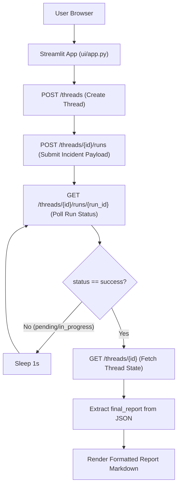

# Streamlit UI Client

FlowCheck includes a lightweight web interface built with **Streamlit** (`ui/app.py`) for submitting incidents, monitoring graph execution, and viewing the resulting `CombinedPlan`.

## Communication Architecture

The UI communicates with the LangGraph deployment over standard REST endpoints:



## Running the UI

Start the Streamlit application from the project root:

```bash
python -m streamlit run ui/app.py
```

The application opens at `http://localhost:8501`.

## Configuration Options

Configuration defaults are located at the top of `ui/app.py`:

```python
DEPLOYMENT_URL = "http://localhost:2024"
ASSISTANT_ID = "agent"
```

- **`DEPLOYMENT_URL`**: Base URL of your running LangGraph server.
- **`ASSISTANT_ID`**: Identifier matching the graph declaration in `langgraph.json` (`agent`).

## Client Protocol Details

### Thread Creation
LangGraph requires a valid JSON body when creating a thread. Calling `/threads` with an empty dictionary (`json={}`) avoids HTTP 422 Unprocessable Entity errors:

```python
def create_thread() -> str:
    resp = requests.post(
        f"{DEPLOYMENT_URL}/threads",
        json={},
        headers={"Content-Type": "application/json"},
    )
    resp.raise_for_status()
    return resp.json()["thread_id"]
```

### Result Extraction
Because the final report is persisted on the thread state rather than the run status response, the UI calls `GET /threads/{thread_id}` upon run completion and performs a recursive search for `final_report`.
